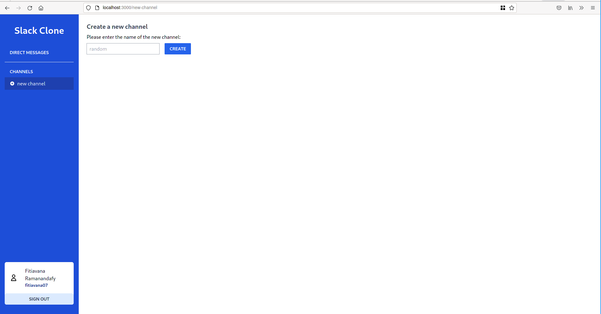
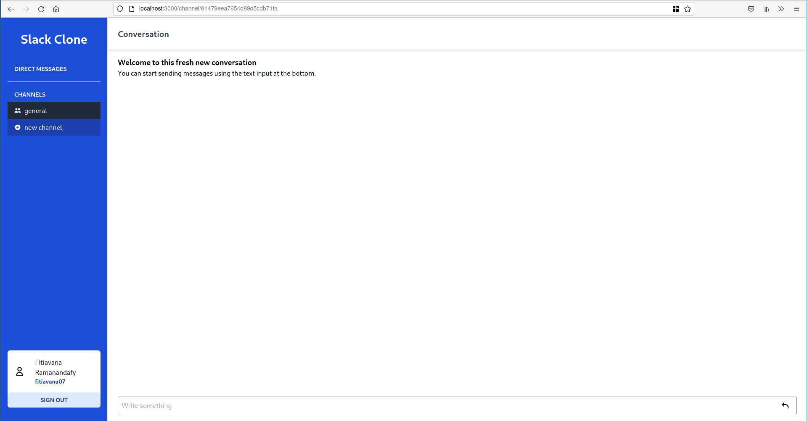

# slack-clone

Slack Clone using React, NodeJS, Typescript, GraphQL and MongoDB.

Made by Fitiavana Ramanandafy.

## Quickstart

The simplest way to run it is using [Docker Compose](https://docs.docker.com/compose/install/).

```bash
docker-compose up -d
```

Open the browser at [http://localhost:3000](http://localhost:3000).

### Without Docker Compose

The program will need [MongoDB](https://www.mongodb.com/) and [Redis](https://redis.io/) installed locally.

Then, run the backend.

```bash
cd back && npm i && npm start
```

Then, run the frontend.

```bash
cd front && npm i && npm start
```

The frontend and the backend has been written using Node v16.8.0, and has been verified to also work on Node v14.15.1.

## Working Features

- [x] Authentication: Signup, Login
- [x] Direct Messages
- [x] Public Channels
- [x] Realtime messaging
- [ ] Connection status
- [ ] Private Channels

## Technologies used

### Stack

- React/Typescript
- NodeJS/Typescript
- GraphQL/ApolloGraphQL
- GraphQL Subscriptions
- MongoDB
- Redis

### Others

- JWT
- Tailwind CSS

## Some screenshots

### Sign up


### Login


### Welcome


### New Channel



### Channel Created



### Direct Messages with realtime updates


### Messages in Channels


